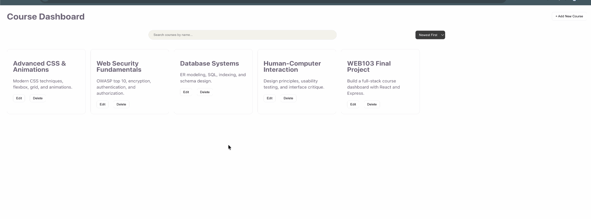

# Mitra

CodePath WEB103 Final Project

Designed and developed by: Jeffrey Chu, Devon Ek, Kieara Blackwood

🔗 Link to deployed app:

## About

### Description and Purpose

Mitra is a fullstack study companion web app that helps college students and lifelong learners organize, connect, and master their coursework. Inspired by tools like NotebookLM, Obsidian, and Notion, Mitra brings together your notes, course materials, and assignments into one intelligent hub. When you're working on an assignment or preparing for an exam, Mitra surfaces the most relevant notes and materials you need so you spend less time searching and more time learning.

The purpose of Mitra is to give students a personalized, self-organized learning environment where their knowledge base grows with them. The app remembers your past assignments, tracks your course curriculum, and generates tailored study plans based on what you're working on. Whether you're reviewing for a midterm or tackling a problem set, Mitra connects the dots across everything you've studied.

### Inspiration

Mitra is named after Sugata Mitra, the researcher who pioneered Self-Organized Learning Environments (SOLEs) and demonstrated that learners can teach themselves when given the right tools and access to information. His work showed that technology, when paired with curiosity, can replace traditional top-down instruction with something more powerful: self-directed discovery.

We were inspired by the fragmented nature of student workflows: notes in one app, slides in another, assignments in a third and wanted to build something that unifies it all. We also drew inspiration from AI-powered tools like Claude Projects and NotebookLM that surface relevant context automatically, and from knowledge management apps like Obsidian that let users build a connected web of information.

## Tech Stack

Frontend:

Backend:

## Features

### Course Dashboard

[✅]Users can create, view, edit, and delete courses. Each course displays its associated notes, materials, and assignments in one organized view.

### Notes Manager

[✅]Users can create, edit, and delete notes. Notes are associated with a specific course and can be tagged for easy retrieval.

[gif goes here]

### Assignment Tracker

[ ]Users can add assignments with due dates, descriptions, and course associations. Assignments can be marked as complete and track progress over time.

[gif goes here]

### Smart Material Linking

[ ]When a user opens an assignment, the app automatically surfaces the most relevant notes and course materials using AI-powered suggestions based on content similarity and tags.

[gif goes here]

### Study Plan Generator

[ ]Based on the user's upcoming assignments and exams, Mitra generates a personalized study plan with recommended review sessions, topics, and study methods.

[gif goes here]

### Exam Prep Mode

[ ]Users can enter an exam topic and Mitra compiles all related notes, materials, and past assignments into a focused review page with suggested study strategies.

[gif goes here]

### Course Material Library

[ ]Users can upload and manage course materials (syllabi, readings, slides) linked to specific courses. Materials are searchable and can be tagged.

[gif goes here]

### Persistent Memory

[ ]The app remembers a user's history — past assignments, study patterns, and notes — and uses this context to improve recommendations over time.

[gif goes here]

### Filter & Sort

[ ]Users can filter and sort notes, assignments, and materials by course, date, tags, status (complete/incomplete), or relevance.

[gif goes here]

### Quick-Add Modal

[ ]A slide-out pane / modal lets users quickly add a new note, assignment, or material from anywhere in the app without navigating away from the current page.

[gif goes here]

## Installation Instructions

[instructions go here]
