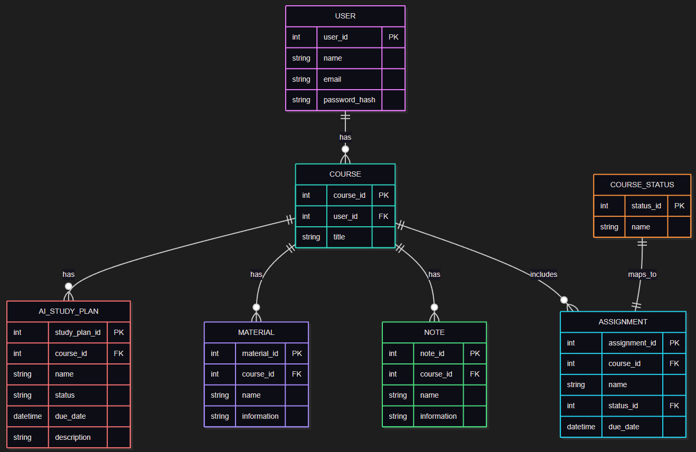

# Entity Relationship Diagram

Reference the Creating an Entity Relationship Diagram final project guide in the course portal for more information about how to complete this deliverable.

## Create the List of Tables

- User Table
	- Stores account information for each user.
- Course Table
	- Stores courses created or tracked by a user.
- Course Status Table
	- Stores allowed status values used by assignments and study tracking.
- Assignment Table
	- Stores assignment details for a course, including due date and status.
- Note Table
	- Stores notes associated with a specific course.
- Material Table
	- Stores course resources/material content associated with a specific course.
- AI Study Plan Table
	- Stores AI-generated study plans specific to a course.

## Add the Entity Relationship Diagram

### User Table

| Column Name | Type | Description |
|-------------|------|-------------|
| user_id | integer | primary key |
| name | text | User display name |
| email | text | User email (unique) |
| password_hash | text | Hashed password for authentication |

### Course

| Column Name | Type | Description |
|-------------|------|-------------|
| course_id | integer | primary key |
| user_id | integer | User associated with course (FK) |
| title | text | Course title |

If this moves to a many-to-many user/course relationship later, a join table should be added between users and courses.

### Course Status

| Column Name | Type | Description |
|-------------|------|-------------|
| status_id | integer | primary key |
| name | text | Status Name (to be returned to FE such as "Incomplete") |

### Assignment

| Column Name | Type | Description |
|-------------|------|-------------|
| assignment_id | integer | primary key |
| course_id | integer | Course Associated with assignment (FK) |
| name | text | Assignment name |
| status_id | integer | Course Status (FK, unique for one-to-one with Course Status) |
| due_date | datetime | Due date of the assignment |

### Note Table

| Column Name | Type | Description |
|-------------|------|-------------|
| note_id | integer | primary key |
| course_id | integer | Course Associated with note (FK) |
| name | text | Note name |
| information | text | Stored note data (can be as JSON for structured notes) |

### Material Table

| Column Name | Type | Description |
|-------------|------|-------------|
| material_id | integer | primary key |
| course_id | integer | Course Associated with note (FK) |
| name | text | Note name |
| information | text | Stored note data (can be as JSON for structured notes) |

### AI Study Plan

| Column Name | Type | Description |
|-------------|------|-------------|
| study_plan_id | integer | primary key |
| course_id | integer | Course associated with AI study plan (FK) |
| name | text | Study plan name |
| status | text | Current status of the plan |
| due_date | datetime | Target completion date |
| description | text | Detailed AI-generated study plan content |
